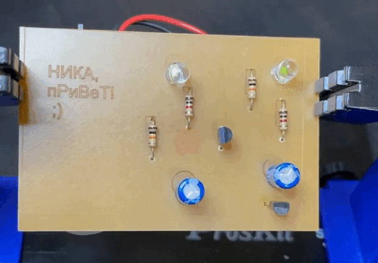
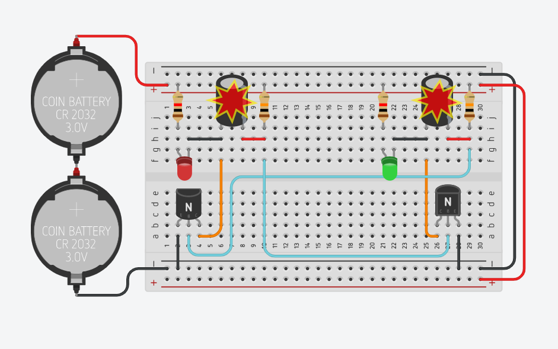
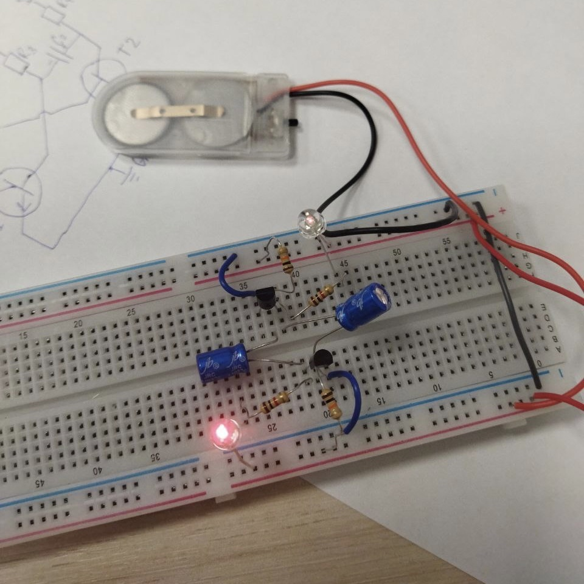
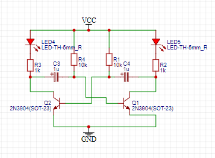
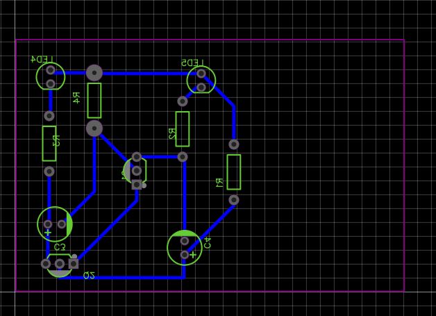
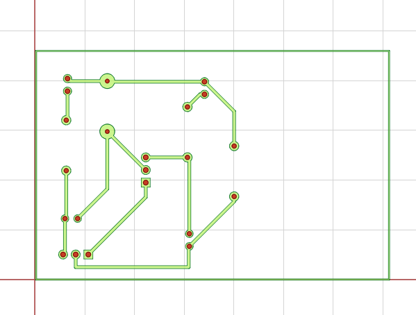
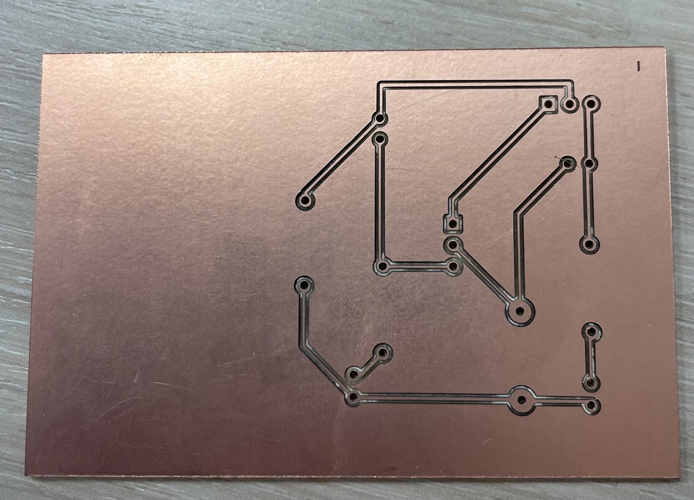
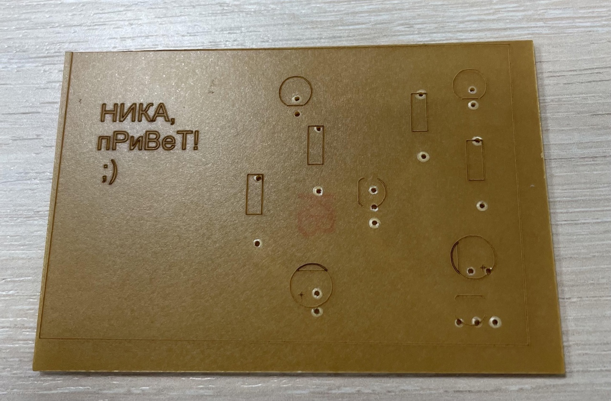
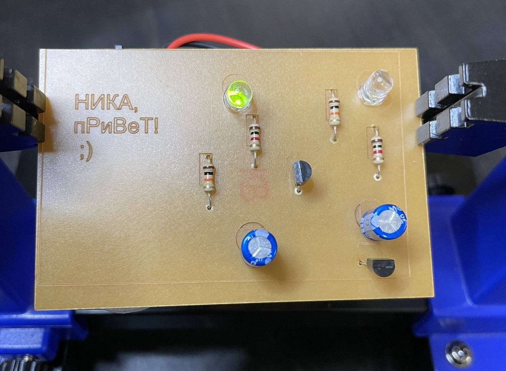

# MULTIMIGATOR

Проект в рамках курса по проектированию и производству электронных устройств на Физтех.Фабрике МФТИ
Результатом данной работы стала плата с поочередно мигающими диодами

  

---------------------------------------------------------------------------------------------------

Проектирование и изготовление состоит из следующих этапов:

### 1. Виртуальное моделирование

Делаем в Tinkercad и видим, что диоды горят (как и конденсаторы))

  

### 2. Моделирование на макетной плате

Вручную собираем схему на учебной плате, чтобы проверить, как это будет работать

  

### 3. Разработка печатной платы

Проектирование платы производится в EasyEDA

Сначала собираем основную схему

  

Затем преобразуем схему в следующий вид и располагаем их уже как на готовой плате

  

### 4. Изготовление платы

Подготавливаем программу для фрезера в FlatCAM

На выходе получаем файл с кодом, указывающем станку каким образом мы хотим обработать плату: дорожки + дырки

  

Загружаем программу в фрезер, устанавливаем нужный инструмент и запускаем станок

Результат раскроя

  

### 5. Шелкография

Делаем с помощью лазера рисунок

  

### 6. Пайка

Заключительным этапом припаиваем все элементы и приклеиваем батарейку

  

Как и ожидалось, диоды мигают поочередно!

  

